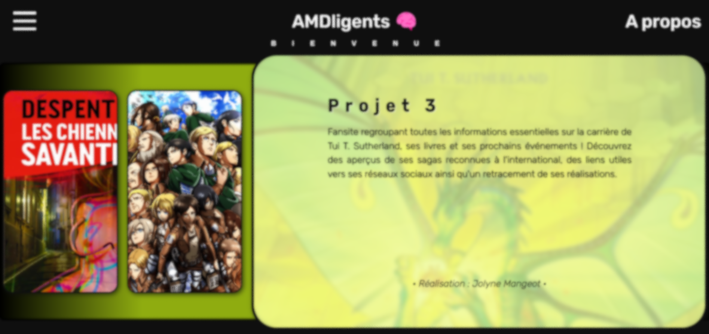

# Fansite-Project

*Développez un site web fan de vos célébrités favorites*

Vous devez développer un site web de fans regroupant vos célébrités,
équipes de sport, groupes de musique (un par personne). Chaque membre
du projet doit créer plusieurs pages HTML utilisant le même fichier CSS
nommé fansite1.css, fansite2.css et fansite3.css (un fichier par personne).

---
<u>Compétences acquises :</u>
- 🛡️**Pages web en HTML5 et CSS** : Création de pages statiques avec des balises HTML5 et du CSS pour la mise en forme.
- 📱**Design Responsive & Adaptive** : Implémentation d'un design flexible et adapté à tous types d'écrans grâce aux media queries et display flex.
- 🔎**Accessibilité Web** : Amélioration de l'accessibilité avec aria-labels et des contrastes appropriés.
- 🔄**Redirections & Navigation** : Mise en place de redirections HTML et d'une navigation fluide entre les pages.

---
Participation :
- [*Armelle Pouzioux*](https://github.com/armelle-pouzioux)
- [*Vladimir Gorbachev](https://github.com/vladimir-gorbachev)
- [*Jolyne Mangeot*](https://github.com/joseph-mangeot)